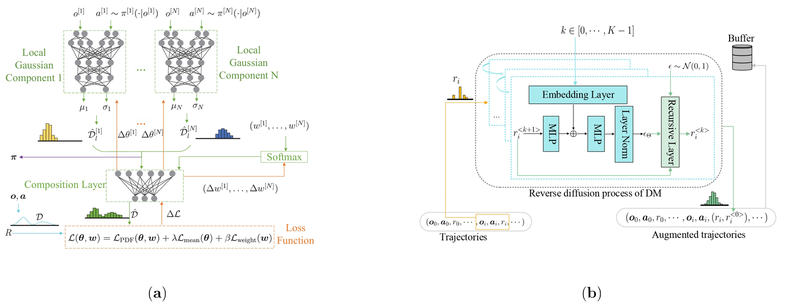

#### **Noise Distribution Decomposition**



**Distribution Decomposition in (a) is designed to decompose noisy reward to ameliorate the annoying impact of noises in Multi-Agent Reinforcement Learning (MARL) . Diffusion model (b) is also used to augment the data for ameliorating the data scarcity issue.**

Note that this is a research project and by definition is unstable. Please write to us if you find something not correct or strange. We are sharing the codes under the condition that reproducing full or part of codes must cite the paper.

```
@article{geng2023noise,
title={Noise Distribution Decomposition based Multi-Agent Distributional Reinforcement Learning},
author={Geng, Wei and Xiao, Baidi and Li, Rongpeng and Wei, Ning and Wang, Dong and Zhao, Zhifeng},
journal={arXiv preprint arXiv:2312.07025, TMC.2024.3492272},
year={2023}
}
```

#### **Features**

<ul><li>A framework about distribution decomposition based on MARL methods.</li><li>Implemented in the environment: Multi-agent Particle world Environments and StarCraft Multi-Agent Challenge.</li><li>Contains mainstream comparison algorithms of MARL (MAPPO, MADDPG, MATD3, QMIX, VDN).</li>
</ul>


#### **Requirements**

```
pip install -r requirements.txt
```


#### **Running**

```
python model_runner.py --env=mpe
```

`--env` must be `mpe` or `smac`, you can appoint the corresponding scene by `--scene_name`.

When other comparison algorithms are needed, you may use `--algorithm`.

DM can be introduced into our methods when set `--DM_enable=True`, which is `False` by default.

You can change the type of noises in different scenarios with `--configuration`. 

For more details, please run ` python model_runner.py --help`.

After the model training is completed, you can use `line_graphs_00` and `line_graphs_01` in `visual_result.py` to reproducing visual results.

Your trained model may behave a little different from ours, but they should be similar.


#### Thanks

This repository is based on [Multi-agent Particle world Environments](https://github.com/openai/multiagent-particle-envs.git) and [StarCraft Multi-Agent Challenge](https://github.com/oxwhirl/smac.git).
